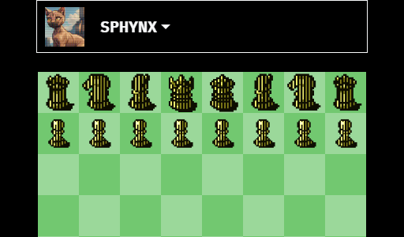

# Cyberpunk Chess

  

Play chess against bots with a cyberpunk aesthetic. Based on the [Wukong JS chess engine](https://github.com/maksimKorzh/wukongJS) and uses modified piece sets from [Kadagaden's chess-pieces repository](https://github.com/Kadagaden/chess-pieces).

## Features

- Play chess, win eddies
- Multiple difficulty levels from beginner to advanced
- Piece square tables, engine depth, opening book, and quiescence variance
- Preem cyberpunk themed boards and pieces
- Glorious [IBM Plex](https://github.com/IBM/plex)

## Getting Started

1. Clone the repository 
2. Open `index.html` in your web browser
3. Play

## License

This project is open source under the [GNU GPLv3](LICENSE.txt) license.